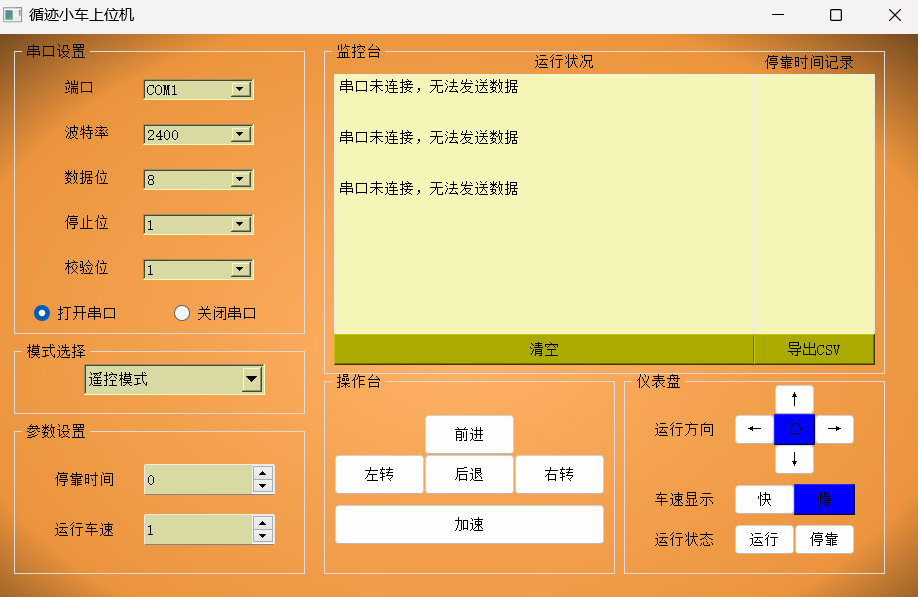

# PyQt5 Host Computer

> **NOTE:** This repo contains code for the whole project.



---

## Installation

1. Create a `conda` environment by running the following command:
    ```bash
    conda env create -f environment.yml
    ```

2. Activate the environment:
    ```bash
    conda activate pyqt
    ```

---

## Usage

To create the UI, run the following command:
```bash
python main.py
```

---

## Pack
To create executable file, run the following command:
```bash
pyinstaller -w -F main.py
```
---

## Update Git
It can be used only in wins.
To update the project version, run the following command:
```bash
update.bat
```